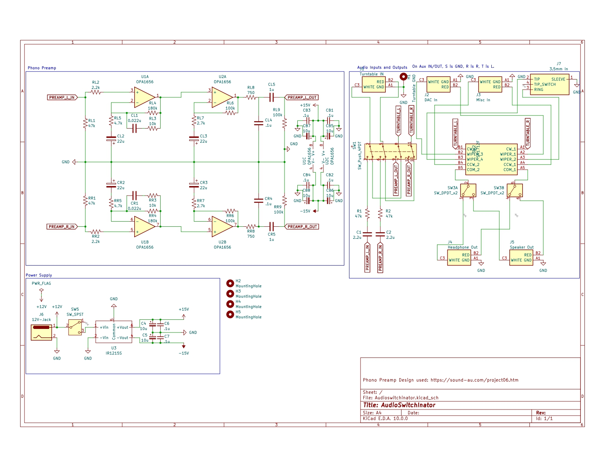
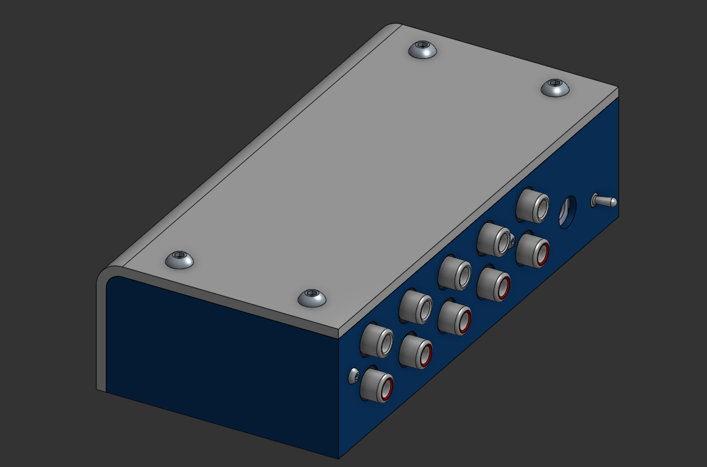
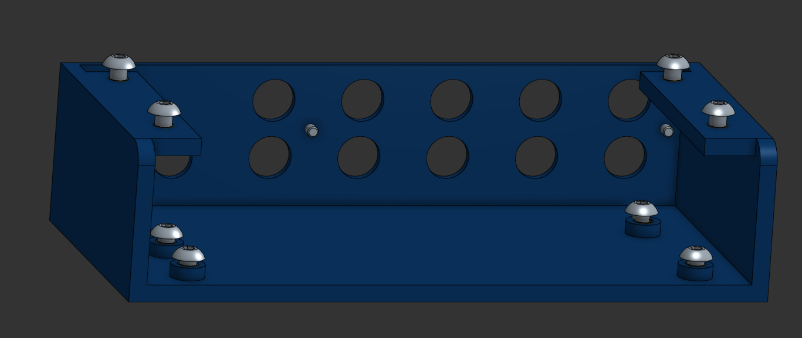
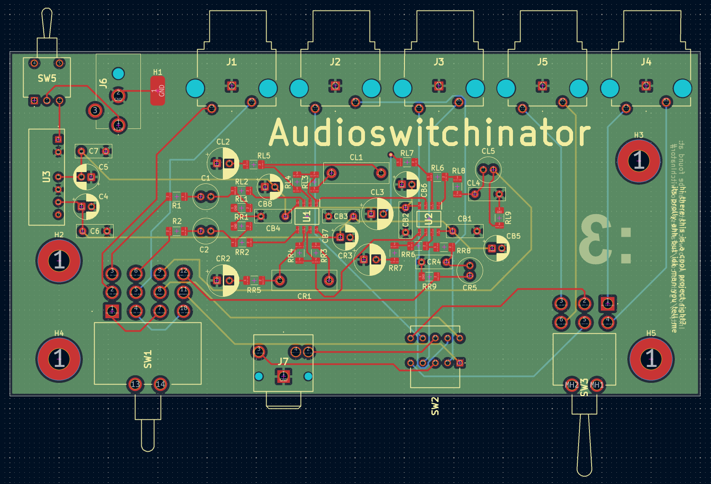
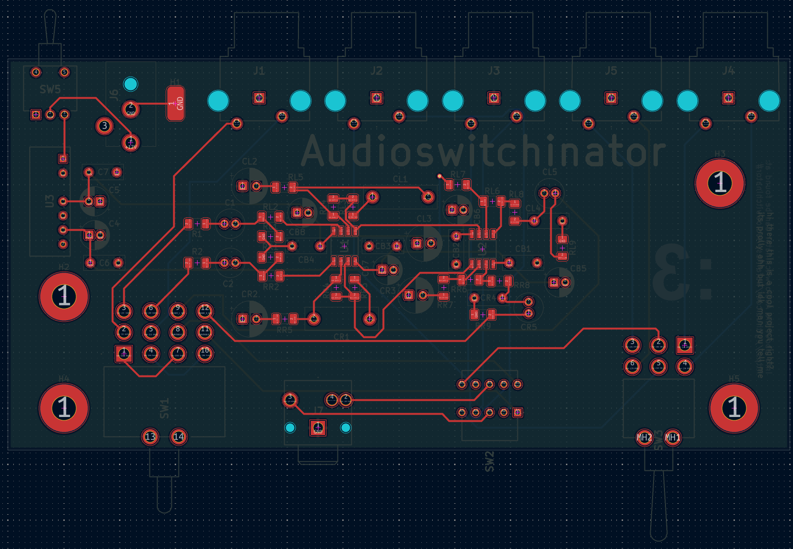
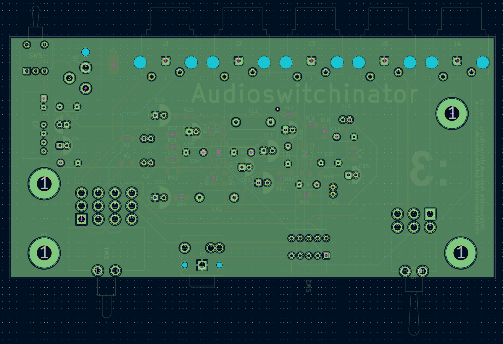
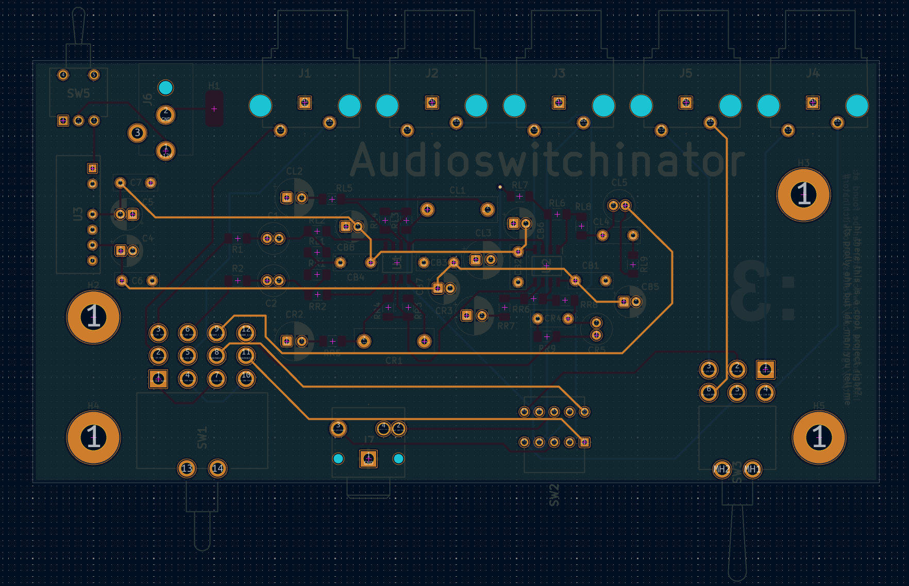
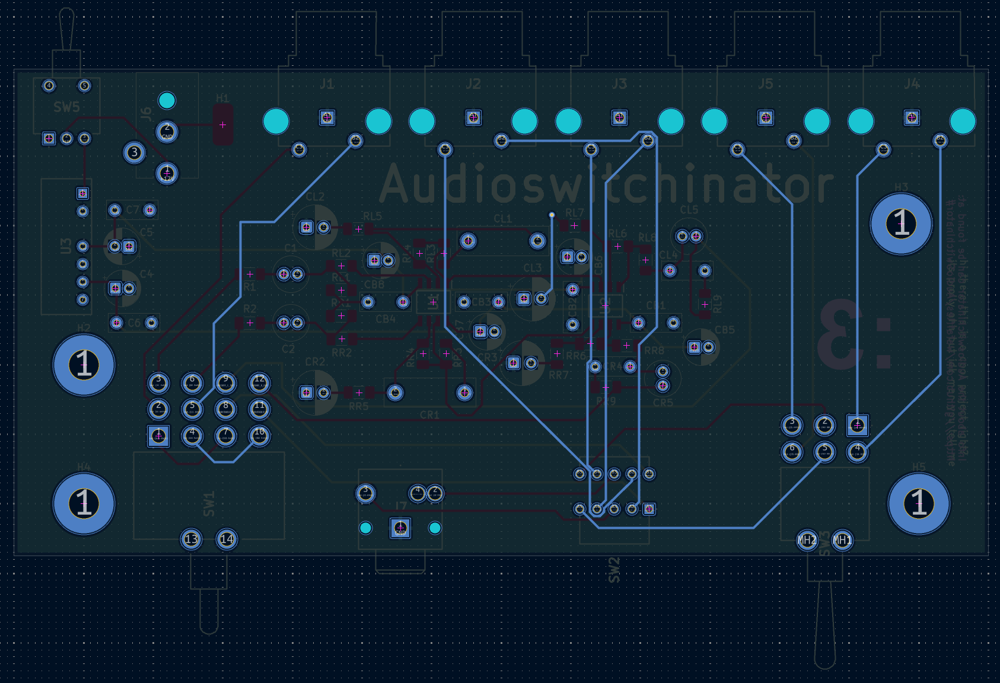
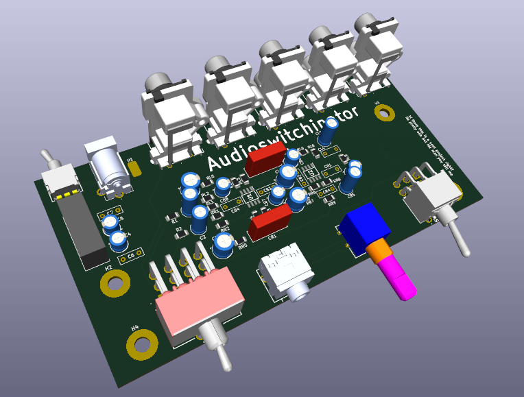
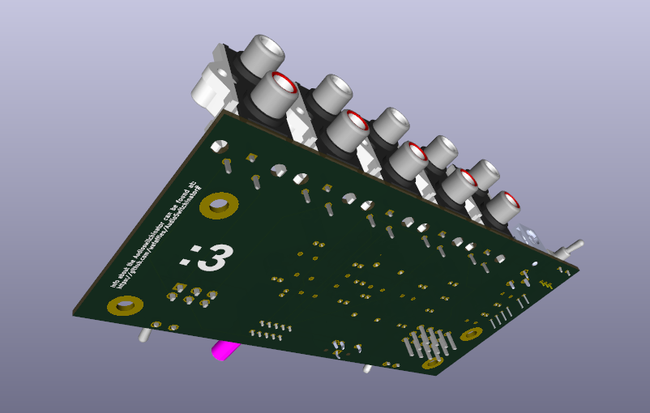

# Audioswitchinator
A multi input and output audio switch with an integrated, toggleable Hifi phono preamp

## Shortcuts
- [Features](#features)
- [What is it?](#what-is-it)
- [Resources](#resources)
- [Bill Of Materials](#bill-of-materials)
- [Photos](#photos)

## Audioswitchinator Zine

## Features
- 4 Inputs
  - 3 RCA
  - 1 3.5mm
- 2 Outputs
  - 2 RCA
- Audio Input and Output Selection
- Integrated Toggleable Phono Preamp for a Turntable

## What is it?

The Audioswitchinator is a device that was made to allow me to route all of my audio inputs and outputs into one place on my desk so that I can easily change where my audio is coming from and going to without having to deal with changing the input on my speakers, changing the output on my computer, and my record player mainly. It features 4 inputs, 3 RCA and 1 3.5mm ports, and 2 ouputs, both being RCA ports. The first of the phono inputs is routed to a toggleable phono preamp, based on this design by [Elliott Sound Products](https://sound-au.com/project06.htm). The mixture of inputs and ports allows for easily compatibility with most audio products, as well as supporting smaller on the go inputs like a phone or other input device. While I only need 2 inputs and 2 outputs currently, the device features the extra inputs and outputs as my equipment arsenal expands or I want to test new products without fully removing the old ones.

The device features a power switch on the rear to power the integrated phono preamp, a switch on the front to enable routing of the turntable input through the phono preamp, a rotary switch to choose which input you would like to listen to, and a switch to choose between either of the two inputs.
It is powered using 12V via a 5.7mm barrell jack. It has a very low power draw of around 50mA at most so nearly any suitable 12V switching mode power supply should work well.

The case is fully 3d printed with use of a few M4 bolts and heatset inserts, but can easily be modified to thread directly into the plastic. The design resembles the design pattern of Schiit Audio products as I currently own a DAC and headphone amp and really like the design. The case is at largest 160x80, so it is easily printable on most 3D printers, being designed to print on my Bambu Labs A1 Mini.

## Resources

CAD Link: https://cad.onshape.com/documents/9e04128c642e582e05c8193e/w/29af00c33977f5103195c9e0/e/9dcbf64564f57b3e7e8e01ad?renderMode=0&uiState=6a12269c000845437493f06b

CAD Files: [HERE](/Models)

ECAD Files: [HERE](/Models)

Production Files: [HERE](/Models)

## Bill Of Materials

Bill of Materials: [HERE](https://docs.google.com/spreadsheets/d/1tNDlkv8S-ZhfvEyZw77WZDcWJRZpA8B7S98ZAzSkEbk/edit?usp=sharing)

## Photos

Audioswitchinator PCB Schematic

Audioswitchinator Case Front

Audioswitchinator Case Back

Audioswitchinator Case Inside

PCB All Layers

PCB F.Cu Layer

PCB In1.Cu Layer

PCB In2.Cu Layer

PCB B.Cu Layer

Fromt of PCB

Back of PCB

## Credits

This project uses:

- [KiCad](https://www.kicad.org/)
- [Figma](https://www.figma.com/)
- [Hack Club Fallout](https://fallout.hackclub.com/path)
